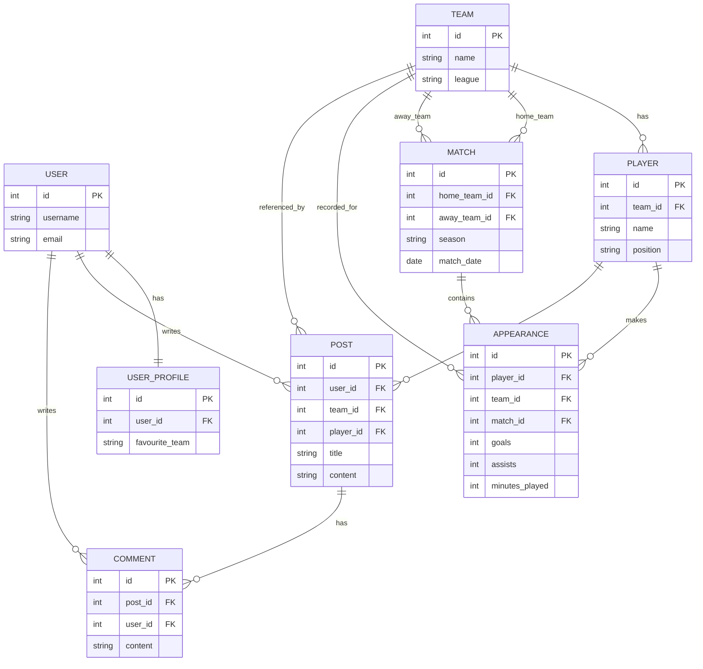

좋아. 네가 올린 초안을 기반으로 **과제 제출용으로 바로 써도 되는 README 완성본**을 만들어줄게.
목표는 다음을 모두 만족하는 것:

* GitHub에서 보기 좋은 구조
* **COMP3011 coursework 요구사항 충족**
* **Swagger / analytics / pagination / rate limiting 강조**
* **ERD 포함**
* **실행 방법 명확**
* **배포 서버 사용 가능**

아래 **전체를 그대로 `README.md`에 붙여넣어도 된다.**

---

# COMP3011 Coursework 1 – Football Data REST API

A RESTful API built with **Django** and **Django REST Framework** that provides data and analytics for football teams, players, matches, and community discussions.

The API supports:

* RESTful resource design
* Authentication and user profiles
* Nested endpoints
* Pagination and rate limiting
* Analytics endpoints
* Interactive API documentation (Swagger / OpenAPI)

---

# Project Overview

This project implements a football data API that allows users to:

* Browse **teams, players, and matches**
* View **player performance statistics**
* Access **analytics endpoints** such as top scorers
* Create **community posts and comments**
* Interact with the API through **Swagger documentation**

The system is designed according to **REST principles** and uses a relational database to store football data imported from external sources.

---

# Technology Stack

Backend framework:

* Django
* Django REST Framework

Database:

* SQLite (development)
* PostgreSQL compatible

Documentation:

* drf-spectacular
* Swagger UI
* OpenAPI Schema

Deployment:

* AWS EC2 (Ubuntu)

---

# Project Structure

```
football_api/
│
├── users/           # authentication and profiles
├── teams/           # teams and players
├── matches/         # matches and statistics
├── analytics/       # analytics endpoints
├── posts/           # community discussion
│
├── config/
│   └── settings.py
│
└── manage.py
```

---

# Entity Relationship Diagram



---

# API Documentation

Interactive API documentation is available via Swagger UI.

Swagger UI:

```
http://16.171.63.159/api/docs/
```

OpenAPI schema:

```
http://16.171.63.159/api/schema/
```

Swagger allows users to:

* explore all endpoints
* test requests
* supply parameters such as `season` and `limit`

---

# Authentication

The API uses **token authentication**.

Register a user:

```
POST /api/auth/register/
```

Login:

```
POST /api/auth/login/
```

Authenticated requests require:

```
Authorization: Token <your_token>
```

---

# Core API Endpoints

## Teams

```
GET /api/teams/
GET /api/teams/{id}/
```

Example response:

```json
{
  "id": 1,
  "name": "Arsenal",
  "league": "Premier League"
}
```

---

## Players

```
GET /api/players/
GET /api/players/{id}/
```

---

## Matches

```
GET /api/matches/
GET /api/matches/{id}/
```

---

# Nested Endpoints

The API provides nested routes to access related resources.

Players in a team:

```
GET /api/teams/{team_id}/players/
```

Player appearances:

```
GET /api/players/{player_id}/appearances/
```

Team matches:

```
GET /api/teams/{team_id}/matches/
```

---

# Analytics Endpoints

Analytics endpoints provide computed statistics from match data.

Top scorers:

```
GET /api/analytics/top-scorers/?season=2023&limit=10
```

Example response:

```json
[
  {
    "player": "Erling Haaland",
    "goals": 27
  }
]
```

Top assists:

```
GET /api/analytics/top-assists/?season=2023&limit=10
```

Team rankings:

```
GET /api/analytics/team-ranking/?season=2023
```

Parameters available in Swagger:

* season
* limit

---

# Community Features

Authenticated users can create posts and comments discussing football topics.

Posts:

```
GET /api/posts/
POST /api/posts/
GET /api/posts/{id}/
PUT /api/posts/{id}/
DELETE /api/posts/{id}/
```

Comments:

```
GET /api/comments/
POST /api/comments/
```

Posts may optionally reference:

* a team
* a player

---

# Pagination

List endpoints support pagination.

Example request:

```
GET /api/players/?page=2
```

Example response:

```json
{
  "count": 450,
  "next": "...",
  "previous": "...",
  "results": [...]
}
```

---

# Rate Limiting

To protect the API from excessive usage, rate limiting is enabled.

Example limit:

```
100 requests per minute per user
```

If the limit is exceeded, the API returns:

```
HTTP 429 Too Many Requests
```

---

# Data Import

Football match and player statistics were imported into the database using a custom Django management command.

Example command:

```
python manage.py import_epl_data
```

This allows the API to serve data directly from the local database instead of relying on live third-party APIs.

---

# Running the Project Locally

Clone the repository:

```
git clone https://github.com/your-repository/football-api.git
```

Navigate to the project folder:

```
cd football-api
```

Create virtual environment:

```
python -m venv venv
```

Activate environment:

Mac / Linux

```
source venv/bin/activate
```

Windows

```
venv\Scripts\activate
```

Install dependencies:

```
pip install -r requirements.txt
```

Run migrations:

```
python manage.py migrate
```

Run server:

```
python manage.py runserver
```

API available at:

```
http://127.0.0.1:8000/api/
```

Swagger documentation:

```
http://127.0.0.1:8000/api/docs/
```

---

# Deployment

The API is deployed on an AWS EC2 instance.

Server URL:

```
http://16.171.63.159/
```

Production documentation:

```
http://16.171.63.159/api/docs/
```

---

# Future Improvements

Possible future improvements include:

* advanced player analytics
* match prediction models
* fan discussion moderation
* caching for analytics queries

---

# Author

COMP3011 Coursework
University of Leeds

---
