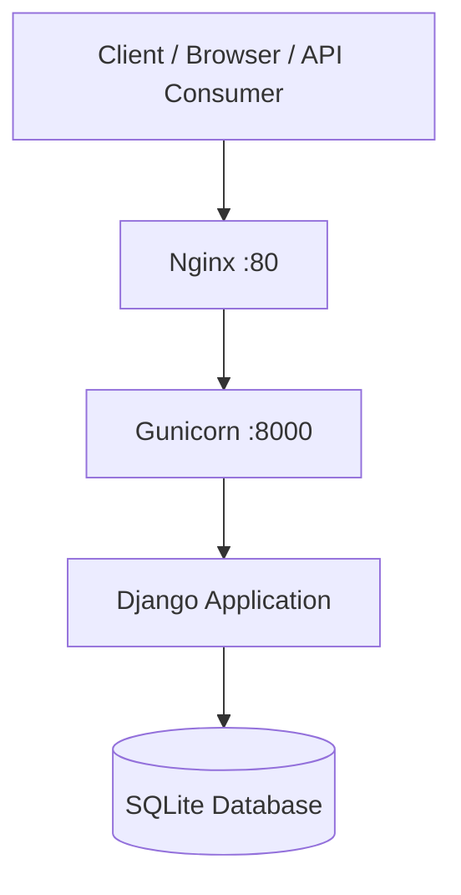
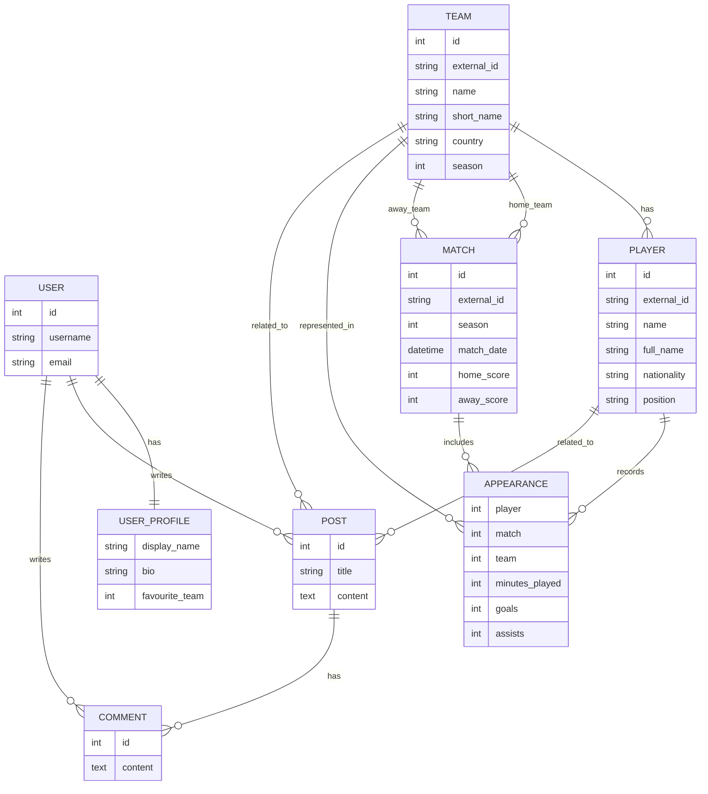
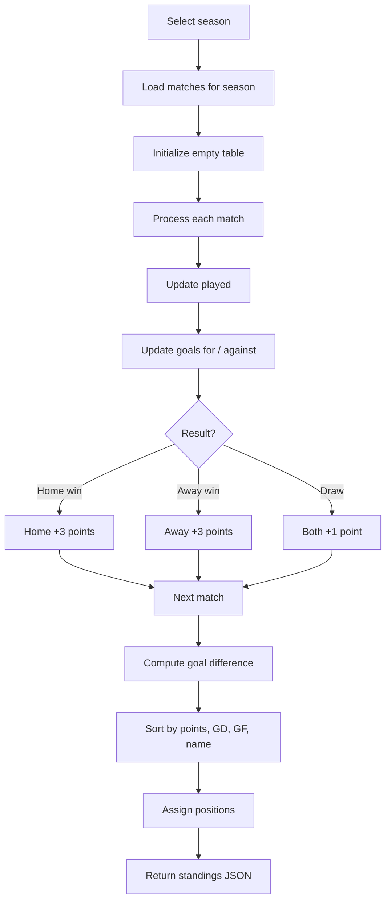
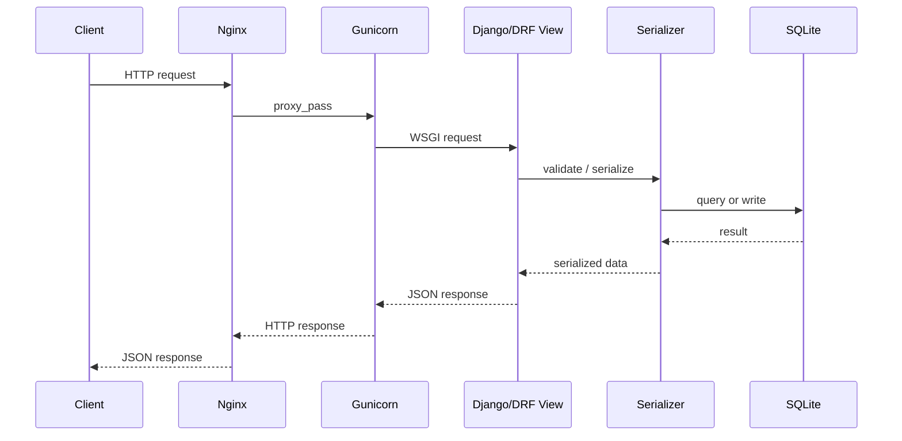

# Football Analytics & Community API

**COMP3011 Coursework 1 – Web Services and Web Data**  
University of Leeds  
Student: Hany Song  
Student ID: 202049082

---

## 1. Project Overview

This project implements a **RESTful football analytics and community discussion API** using **Django** and **Django REST Framework**.

The system combines two domains in one service:

1. **Football data and analytics**
   - teams
   - players
   - matches
   - player appearances
   - aggregate statistics such as top scorers, top assists, most minutes played, and league standings

2. **Community features**
   - user registration and login
   - user profiles
   - discussion posts
   - comments
   - likes on posts and comments

The project was designed to satisfy the COMP3011 requirement for a **data-driven web API with database integration**, clear documentation, external deployment, and justification of design choices. The coursework brief explicitly highlights sports analytics APIs as a suitable project direction, including CRUD for teams, players, and matches plus analytical endpoints for leaderboards and performance summaries.

---

## 2. Key Features

- RESTful resource design
- Token-based authentication
- Football data models backed by SQLite
- Analytics endpoints using aggregation and computed standings
- Community discussion endpoints with permissions
- Pagination for list endpoints
- Rate limiting for anonymous and authenticated users
- Swagger / OpenAPI documentation
- Automated API testing
- Custom dataset import command
- External deployment on AWS EC2 using Nginx + Gunicorn

---

## 3. Live Deployment and Documentation

### Live API
`http://16.171.63.159/`

### Swagger UI
`http://16.171.63.159/api/docs/`

### OpenAPI Schema
`http://16.171.63.159/api/schema/`

### API Documentation PDF
📄 **[COMP3011_API_Documentation.pdf](COMP3011_API_Documentation.pdf)**

> This repository submission should include the exported API documentation PDF above, as required by the coursework brief. The brief states that API documentation must be referenced in the README as a PDF file.

---

## 4. Why This Project Fits the Module Brief

The module brief requires:
- at least one data model with full CRUD linked to a database
- at least four HTTP endpoints
- correct JSON responses and status codes
- documentation
- runnable code
- external hosting or equivalent demonstration environment

This project satisfies those requirements through:
- CRUD-style community resources (`posts`, `comments`)
- football resources (`teams`, `players`, `matches`)
- authentication endpoints
- analytics endpoints
- JSON responses via Django REST Framework
- Swagger documentation
- external deployment on AWS EC2

The brief also encourages public datasets, sports analytics use cases, and declared use of Generative AI in a structured and reflective way.

---

## 5. Technology Stack

| Layer | Technology |
|---|---|
| Programming language | Python 3 |
| Web framework | Django 5.2.12 |
| API framework | Django REST Framework 3.16.1 |
| Documentation | drf-spectacular |
| Authentication | DRF Token Authentication |
| Database | SQLite3 |
| Web server | Nginx |
| WSGI server | Gunicorn |
| Deployment | AWS EC2 |
| Testing | DRF APITestCase / Django test runner |

The project dependencies in `requirements.txt` include Django, Django REST Framework, `drf-spectacular`, and `requests`.

---

## 6. System Architecture

The project follows a **modular Django application structure**.

```text
COMP3011-Coursework1/
├── accounts/       # authentication and user profiles
├── community/      # posts, comments, likes
├── config/         # global settings and root routing
├── data/           # imported CSV dataset files
├── football/       # football models, endpoints, analytics
├── manage.py
├── requirements.txt
└── db.sqlite3
```

### Application responsibilities

| App | Responsibility |
|---|---|
| `accounts` | registration, login, current-user endpoint, logout, account deletion, profile data |
| `football` | teams, players, matches, appearances, filters, nested resources, analytics |
| `community` | posts, comments, likes, author-based permissions |
| `config` | global routing, REST framework settings, schema and Swagger configuration |

This separation makes the code easier to maintain and supports the “clean, modular code design” expected in higher grade bands. The coursework criteria explicitly reward modular design, thorough testing, professional deployment, and comprehensive documentation.

---

## 7. Deployment Architecture

The production deployment uses **Nginx + Gunicorn + Django** on AWS EC2.



### Production request path

1. A client sends an HTTP request to the EC2 public address.
2. Nginx accepts the request on port 80.
3. Nginx forwards the request to Gunicorn.
4. Gunicorn serves the Django application.
5. Django processes the request, queries the database if needed, and returns a JSON response.

### Deployment notes

Production `ALLOWED_HOSTS` includes:

- `16.171.63.159`
- `ec2-16-171-63-159.eu-north-1.compute.amazonaws.com`

This matches the deployment configuration you described and is consistent with a public EC2 deployment.

### Deployment challenge and resolution

The initial EC2 deployment experienced instability on a small `t3.nano` instance because memory pressure caused the Linux OOM killer to terminate Gunicorn. The issue was mitigated by:
- reducing Gunicorn worker count
- correcting `ALLOWED_HOSTS`
- improving deployment robustness

This is worth mentioning in the technical report and oral exam because it demonstrates troubleshooting and real deployment experience rather than simply “getting it to run”.

---

## 8. Project Structure

```text
accounts/
├── migrations/
├── admin.py
├── apps.py
├── models.py
├── serializers.py
├── tests.py
├── views.py
└── urls.py

football/
├── migrations/
├── management/
   └── commands/
      └── import_football_data.py
├── admin.py
├── apps.py
├── models.py
├── serializers.py
├── tests.py
├── views.py
└── urls.py

community/
├── migrations/
├── admin.py
├── apps.py
├── models.py
├── serializers.py
├── permissions.py
├── tests.py
├── views.py
└── urls.py

config/
├── asgi.py
├── wsgi.py
├── settings.py
└── urls.py
```

### Important configuration features

The project settings include:
- token authentication as the default authentication class
- pagination with page size 10
- throttling for anonymous and authenticated users
- drf-spectacular as the default schema generator

The configured throttle limits are:
- anonymous users: `30/minute`
- authenticated users: `120/minute`

---

## 9. Database Design

The API models two connected domains:

- **football statistics**
- **community discussion**

The football side is designed around a normalized structure where player performance is stored per match in the `Appearance` table. This makes aggregate analytics practical and efficient.

The core entities are:
- Team
- Player
- Match
- Appearance
- UserProfile
- Post
- Comment

Among these, **Appearance** is the key bridge entity linking a player, a team, and a match. This model enables the analytics features of the system, including top scorers, top assists, most minutes played, and player appearance histories.

---

## 10. Entity Relationship Diagram



### Why the `Appearance` model matters

The `Appearance` model is the core analytical bridge in the system. Instead of storing only match-level results, the project also stores player-level contributions within each match. That makes it possible to compute:
- top scorers
- top assists
- most minutes played
- team-specific top scorers
- player appearance histories

---

## 11. Dataset and Data Import

This project uses the public Kaggle dataset:

`https://www.kaggle.com/datasets/davidcariboo/player-scores`

### Files used
- `clubs.csv`
- `players.csv`
- `games.csv`
- `appearances.csv`

### Mapping to project models

| Dataset file | Imported into |
|---|---|
| `clubs.csv` | `Team` |
| `players.csv` | `Player` |
| `games.csv` | `Match` |
| `appearances.csv` | `Appearance` |

The coursework brief explicitly encourages students to use public datasets and identifies Kaggle as a suitable source. It also encourages using GenAI to assist with dataset discovery and import scripting, provided the usage is declared.

### Import command

Data import is implemented through a custom Django management command:

```bash
python manage.py import_football_data
```

### Import order

The import process is performed in dependency order:

1. `clubs.csv` → `Team`
2. `players.csv` → `Player`
3. `games.csv` → `Match`
4. `appearances.csv` → `Appearance`

This ordering ensures foreign keys are valid when later records are inserted.

---

## 12. Why Django + DRF + SQLite

### Django
Django was chosen because it provides:
- mature ORM support
- rapid model-driven development
- built-in admin and migration tooling
- clean integration with REST extensions

### Django REST Framework
DRF was chosen because it provides:
- serializers
- generic class-based API views
- authentication and permissions
- pagination
- throttling
- test utilities

### SQLite
SQLite was chosen because:
- it is lightweight and easy to configure
- it is sufficient for coursework-scale deployment
- it integrates seamlessly with Django
- it reduces operational complexity during development and assessment

This choice is still aligned with the brief, which permits SQL databases and focuses more on design, implementation, documentation, and justification than on enterprise-scale infrastructure.

---

## 13. Authentication and User Management

Authentication is implemented using **DRF Token Authentication**.

### Authentication endpoints

| Method | Endpoint | Purpose |
|---|---|---|
| POST | `/api/auth/register/` | create a new user and profile |
| POST | `/api/auth/login/` | authenticate and obtain token |
| GET | `/api/auth/me/` | return the currently authenticated user |
| POST | `/api/auth/logout/` | delete the current auth token |
| DELETE | `/api/auth/delete/` | delete the authenticated account |

These routes are defined in the accounts URLs configuration.

### Profile fields

During registration, users can provide:
- `username`
- `email`
- `password`
- `display_name`
- `bio`
- `favourite_team` 

### Example register request

```json
{
  "username": "newuser",
  "email": "newuser@example.com",
  "password": "verystrongpassword123",
  "display_name": "New User",
  "bio": "Hello there",
  "favourite_team": 1
}
```

### Example login response

```json
{
  "message": "Login successful",
  "token": "generated_token_here",
  "user": {
    "id": 1,
    "username": "newuser",
    "email": "newuser@example.com",
    "profile": {
      "display_name": "New User",
      "bio": "Hello there",
      "favourite_team": 1,
      "favourite_team_name": "Arsenal",
      "created_at": "2026-03-12T20:00:00Z",
      "updated_at": "2026-03-12T20:00:00Z"
    }
  }
}
```

---

## 14. REST API Design

The API is organized around clear resources.

### Core football resources

| Method | Endpoint | Description |
|---|---|---|
| GET | `/api/teams/` | list teams |
| GET | `/api/teams/{id}/` | team detail |
| GET | `/api/players/` | list players |
| GET | `/api/players/{id}/` | player detail |
| GET | `/api/matches/` | list matches |
| GET | `/api/matches/{id}/` | match detail |

### Nested football resources

| Method | Endpoint | Description |
|---|---|---|
| GET | `/api/teams/{id}/players/` | list players in a team |
| GET | `/api/teams/{id}/matches/` | list matches involving a team |
| GET | `/api/teams/{id}/top-scorers/` | top scorers for one team |
| GET | `/api/players/{id}/matches/` | matches played by a player |
| GET | `/api/players/{id}/appearances/` | appearance summaries for a player |

These endpoints are consistent with the `football` URL configuration.

### Community resources

| Method | Endpoint | Description |
|---|---|---|
| GET | `/api/posts/` | list posts |
| POST | `/api/posts/` | create post |
| GET | `/api/posts/{id}/` | post detail |
| PUT | `/api/posts/{id}/` | update full post |
| PATCH | `/api/posts/{id}/` | partial update |
| DELETE | `/api/posts/{id}/` | delete post |
| GET | `/api/comments/?post_id={id}` | list comments for a post |
| POST | `/api/comments/` | create comment |
| GET | `/api/comments/{id}/` | comment detail |
| PUT | `/api/comments/{id}/` | update full comment |
| PATCH | `/api/comments/{id}/` | partial update |
| DELETE | `/api/comments/{id}/` | delete comment |

### Like endpoints

| Method | Endpoint | Description |
|---|---|---|
| POST | `/api/posts/{id}/like/` | like a post |
| DELETE | `/api/posts/{id}/like/` | remove like from a post |
| POST | `/api/comments/{id}/like/` | like a comment |
| DELETE | `/api/comments/{id}/like/` | remove like from a comment |

The community views implement `IsAuthenticatedOrReadOnly` for create/update protection and `IsAuthorOrReadOnly` to restrict modification or deletion to authors. 

---

## 15. Query Parameters and Filtering

### Player filters

The player list endpoint supports:
- `team_id`
- `position`
- `nationality`
- `name`
- `ordering` (in the latest version of your implementation)

Example:

```bash
GET /api/players/?team_id=1&name=Saka
```

### Match filters

The match list endpoint supports:
- `season`
- `team_id`

Example:

```bash
GET /api/matches/?season=2023&team_id=2
```

### Comment filtering

Comments must be requested with `post_id` in the community view version you are currently using for assessment. If it is missing on GET, a validation error is raised.

Example:

```bash
GET /api/comments/?post_id=5
```

---

## 16. Analytics Endpoints

The project includes dedicated analytics endpoints.

| Method | Endpoint | Description |
|---|---|---|
| GET | `/api/analytics/top-scorers/` | highest scorers in a season |
| GET | `/api/analytics/top-assists/` | highest assist totals in a season |
| GET | `/api/analytics/most-minutes/` | players with most minutes played |
| GET | `/api/analytics/standings/` | computed league table |
| GET | `/api/teams/{id}/top-scorers/` | top scorers for one team |

The football views compute these values through aggregation on the `Appearance` model and derived standings from `Match` results. 

### Example: top scorers

```bash
GET /api/analytics/top-scorers/?season=2023&limit=10
```

Example response:

```json
[
  {
    "player_id": 1,
    "player_name": "Erling Haaland",
    "team": "Manchester City",
    "total_goals": 36,
    "season": 2023
  }
]
```

### Example: top assists

```bash
GET /api/analytics/top-assists/?season=2023&limit=10
```

### Example: most minutes

```bash
GET /api/analytics/most-minutes/?season=2023&limit=10
```

### Example: standings

```bash
GET /api/analytics/standings/?season=2023
```

---

## 17. Standings Calculation Algorithm

The standings endpoint is not read from a precomputed league table. It is calculated dynamically from the `Match` model.

The implementation:
- selects matches for the requested season, or the latest season if omitted
- initializes a table entry for each team encountered
- increments matches played for both teams
- accumulates goals for and goals against
- awards:
  - 3 points for a win
  - 1 point each for a draw
  - 0 points for a loss
- computes goal difference as `goals_for - goals_against`
- sorts by:
  1. points descending
  2. goal difference descending
  3. goals for descending
  4. team name ascending
- assigns final league positions
- returns the first 20 teams

### Algorithm summary

```text
for each match in selected season:
    initialize home team row if missing
    initialize away team row if missing

    played += 1 for both teams

    goals_for / goals_against updated for both teams

    if home_goals > away_goals:
        home wins, away loses, home gets 3 points
    elif away_goals > home_goals:
        away wins, home loses, away gets 3 points
    else:
        both draw, both get 1 point

goal_difference = goals_for - goals_against

sort by:
    points desc
    goal_difference desc
    goals_for desc
    team asc

assign positions 1..n
```

### Standings calculation flow diagram



### Limitation of standings

You already noted an important practical limitation: the source match dataset is incomplete for some fixtures, so standings are only as accurate as the imported match records. This is a data limitation rather than a logic error, and it is worth stating explicitly in both the README and report.

---

## 18. Sequence Diagram: API Request Flow

The following sequence diagram shows the flow of an API request through the deployed stack.



---

## 19. Community Features and Permissions

The community side of the project provides actual CRUD functionality for user-generated content, which is important because the brief requires database-backed CRUD operations.

### Posts
Authenticated users can:
- create posts
- update their own posts
- delete their own posts
- like and unlike posts

Anonymous users can:
- read posts

### Comments
Authenticated users can:
- create comments
- update their own comments
- delete their own comments
- like and unlike comments

Anonymous users can:
- read comments

### Permission rule
`IsAuthorOrReadOnly` allows safe methods for everyone but restricts edits and deletes to the object author.
---

## 20. Error Handling and Status Codes

The coursework brief explicitly expects correct status and error handling.

Examples implemented in this project include:
- `201 Created` for successful registration and resource creation
- `200 OK` for successful reads, updates, likes, and logout
- `400 Bad Request` for malformed input
- `401 Unauthorized` for unauthenticated protected access or invalid login
- `403 Forbidden` when a user tries to modify content they do not own
- validation errors for missing required parameters such as `post_id` on comment listing in the current implementation 

---

## 21. Pagination

List endpoints use DRF page-number pagination.

### Configuration
- default pagination class: `PageNumberPagination`
- page size: `10`

### Example

```bash
GET /api/players/?page=2
```

Typical response shape:

```json
{
  "count": 120,
  "next": "http://16.171.63.159/api/players/?page=3",
  "previous": "http://16.171.63.159/api/players/?page=1",
  "results": [
    {
      "id": 45,
      "name": "Mohamed Salah",
      "position": "Forward",
      "nationality": "Egypt"
    }
  ]
}
```

---

## 22. Rate Limiting

The API uses DRF throttling to reduce abuse and protect the service.

### Limits
- anonymous: `30/minute`
- authenticated user: `120/minute`

This is particularly useful for a public deployed API and demonstrates awareness of production concerns.

---

## 23. Swagger / OpenAPI Documentation

The API uses `drf-spectacular` to generate an OpenAPI schema and interactive Swagger UI.

Configured routes:
- `/api/schema/`
- `/api/docs/` 

The settings also define tags for:
- Authentication
- Teams
- Players
- Matches
- Analytics
- Posts
- Comments

This improves documentation quality and makes the project easier to demonstrate during the oral examination.

---

## 24. Testing

Automated tests are implemented across all main apps:
- `accounts_tests.py`
- `football_tests.py`
- `community_tests.py`

### What is tested

#### Accounts tests
Examples include:
- successful registration
- login success and failure
- authenticated `me` endpoint
- logout token deletion
- account deletion

#### Football tests
Examples include:
- team listing
- player filtering by team and name
- match filtering by season and team
- match detail with nested appearances
- team players endpoint
- player appearances endpoint
- top scorers and other analytics

#### Community tests
Examples include:
- anonymous read access
- authenticated post creation
- author-only update protection
- comment filtering
- comment creation
- like and unlike behavior for posts and comments

### Running tests

```bash
python manage.py test
```

Your recent test run reported **31 tests**, which is strong evidence of a systematic testing approach.

---

## 25. Local Setup Instructions

### 1. Clone the repository

```bash
git clone <your-github-repo-url>
cd COMP3011-Coursework1
```

### 2. Create and activate a virtual environment

#### Windows
```bash
python -m venv venv
venv\Scripts\activate
```

#### macOS / Linux
```bash
python3 -m venv venv
source venv/bin/activate
```

### 3. Install dependencies

```bash
pip install -r requirements.txt
```

### 4. Apply migrations

```bash
python manage.py makemigrations
python manage.py migrate
```

### 5. Import dataset

Place the required CSV files in the expected `data/` directory, then run:

```bash
python manage.py import_football_data
```

### 6. Create a superuser (optional)

```bash
python manage.py createsuperuser
```

### 7. Start the server

```bash
python manage.py runserver
```

### 8. Open the API

- API root resources: `http://127.0.0.1:8000/api/`
- Swagger docs: `http://127.0.0.1:8000/api/docs/`

---

## 26. Example Usage

### Get all teams
```bash
curl http://127.0.0.1:8000/api/teams/
```

### Search players by name
```bash
curl "http://127.0.0.1:8000/api/players/?name=Saka"
```

### Get matches for a team in a season
```bash
curl "http://127.0.0.1:8000/api/teams/1/matches/?season=2023"
```

### Get top scorers
```bash
curl "http://127.0.0.1:8000/api/analytics/top-scorers/?season=2023&limit=5"
```

### Register a user
```bash
curl -X POST http://127.0.0.1:8000/api/auth/register/ \
  -H "Content-Type: application/json" \
  -d "{\"username\":\"newuser\",\"email\":\"newuser@example.com\",\"password\":\"verystrongpassword123\",\"display_name\":\"New User\",\"bio\":\"Hello there\",\"favourite_team\":1}"
```

### Create a post
```bash
curl -X POST http://127.0.0.1:8000/api/posts/ \
  -H "Authorization: Token <your_token>" \
  -H "Content-Type: application/json" \
  -d "{\"title\":\"Liverpool discussion\",\"content\":\"Great performance this week.\",\"related_team\":1}"
```

---

## 27. Design Decisions

### REST rather than GraphQL
The coursework brief allows REST or GraphQL, but this project uses REST because:
- the resource structure is clear and natural
- DRF provides strong built-in support
- REST is easy to document with Swagger
- the endpoints map well to coursework expectations around CRUD and HTTP conventions

### Modular app design
Separating `accounts`, `football`, and `community` improves maintainability and makes the system easier to present in the oral exam.

### Computed analytics rather than static tables
Analytics endpoints are derived from raw match and appearance records rather than stored as hard-coded summaries. This better demonstrates database querying and aggregation.

### Community layer added on top of football data
Adding community discussion makes the project more than just a read-only sports dataset wrapper. It introduces authenticated CRUD, permissions, and richer user interaction.

---

## 28. Limitations

Current limitations include:

1. **Dataset completeness**
   - some source match data is missing, so computed standings may not exactly match official tables

2. **SQLite in production**
   - SQLite is acceptable for coursework and simple deployment, but PostgreSQL would be more appropriate for a larger multi-user production system

3. **No real-time data ingestion**
   - the system currently uses imported static dataset files rather than live API refreshes

4. **No frontend client**
   - the project is API-first and demonstrated through Swagger, curl, and tests rather than a separate web frontend

These limitations should also be acknowledged in the technical report, because the brief expects reflection on limitations and future improvements.

---

## 29. Future Improvements

Possible future enhancements:

- migrate to PostgreSQL
- add more leagues and seasons
- support live data refresh from an external football API
- add richer analytics such as per-90 metrics or form windows
- build a frontend dashboard for visualization
- add search across posts and comments
- add admin moderation features
- add JWT authentication as an alternative to token auth

---

## 30. Generative AI Declaration

This coursework is a **Green Light Assessment**, and the brief explicitly permits GenAI use provided it is declared.

Generative AI tools were used in the following ways:
- debugging Django and DRF issues
- exploring API design alternatives
- improving serializer and documentation structure
- helping design dataset import logic
- proofreading and refining README and report writing

All generated suggestions were reviewed, adapted, tested, and integrated manually. Final responsibility for the design, implementation, and submission remains with the student.

> Conversation logs and supporting evidence should be included in the supplementary material / appendix for the final submission package, as required by the brief.

---

## 31. Deliverables Checklist

This repository is intended to support the coursework deliverables required in the brief:

- source code with version history
- `README.md`
- API documentation PDF
- technical report
- presentation slides

### Recommended repository contents for submission

```text
README.md
COMP3011_API_Documentation.pdf
COMP3011_Technical_Report.pdf
COMP3011_Presentation_Slides.pptx
source code/
```

---

## 32. Conclusion

This project demonstrates a complete **data-driven REST API** that combines:
- relational data modelling
- analytical query design
- authenticated CRUD operations
- permissions
- documentation
- testing
- and external deployment

It aligns well with the COMP3011 coursework brief by delivering a publicly documented, database-backed sports analytics API with additional community functionality, supported by testing and deployment evidence. 

---

## 33. License

This project was developed for educational purposes as part of **COMP3011: Web Services and Web Data** at the University of Leeds.
